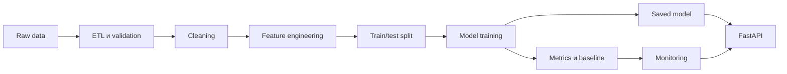
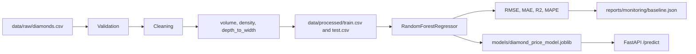

# Automation ML Diamonds

[](https://www.python.org/)
[](https://python-poetry.org/)
[](https://docs.astral.sh/ruff/)
[](https://mypy-lang.org/)
[](https://pre-commit.com/)
[](https://fastapi.tiangolo.com/)
[](https://docs.docker.com/compose/)
[](LICENSE)

MLOps-проект для предсказания стоимости бриллиантов.

Текущая версия: `1.1.0` (единственный источник версии: `pyproject.toml`).

Проект демонстрирует воспроизводимый ML workflow для табличной задачи регрессии: предсказание цены бриллианта (`price`) по данным Kaggle Diamonds Dataset.

Основной акцент сделан на понятной архитектуре, стабильном локальном запуске, автоматизированных тестах, Docker, CI/CD, monitoring и прозрачной структуре репозитория. В версии 1.1.0 код приведён к production-стандартам, зависимости переведены на Poetry, подключены линтеры и pre-commit, а виртуальное окружение интегрировано в репозиторий.

## Бизнес-задача

Нужно предсказать стоимость бриллианта по его характеристикам:

- `carat`
- `cut`
- `color`
- `clarity`
- `depth`
- `table`
- `x`
- `y`
- `z`

Целевая переменная: `price`

Тип задачи: регрессия

Датасет: [Kaggle Diamonds Dataset](https://www.kaggle.com/datasets/shivam2503/diamonds)

Презентация - https://drive.google.com/file/d/1yhTzTyjb7gmj4y4bQLWzS0v7sFHl4q5n/view?usp=sharing

## Почему выбран Diamonds Dataset

- Датасет простой, интерпретируемый и хорошо подходит для проверки полного ML workflow.
- Данные табличные, есть числовые и категориальные признаки.
- Целевая переменная понятна: цена бриллианта.
- На этом датасете удобно показать ETL, preprocessing, feature engineering, model training, FastAPI, tests, Docker, CI/CD и monitoring.
- В отличие от NLP-задач, проект не перегружается обработкой текста и остается сфокусированным на MLOps.

## Архитектурная схема



## Схема pipeline



## Автоматизация ML pipeline

Для задачи регрессии на табличных данных выбран `RandomForestRegressor` как стабильный baseline. Автоматизация реализована через единый `sklearn Pipeline` с `ColumnTransformer`: numeric и categorical features обрабатываются единообразно, а preprocessing становится частью обучаемого pipeline.

Такой подход обеспечивает воспроизводимость, уменьшает риск расхождения между training и inference и упрощает поддержку модели. При обучении pipeline выполняет imputation, scaling, encoding и fit модели; при inference тот же pipeline применяет сохраненную preprocessing-логику перед prediction.

## Что реализовано

- ETL pipeline: загрузка данных, validation, cleaning, feature engineering и сохранение обработанных данных.
- Реальное обучение модели `RandomForestRegressor`.
- Реальные метрики после обучения: RMSE, MAE, R2, MAPE.
- FastAPI-приложение с endpoint-ами для health check, prediction и информации о модели.
- Легкий monitoring:
  - baseline metrics;
  - data drift по числовым признакам;
  - degradation detection;
  - CPU/RAM/disk usage через `psutil`.
- Тесты на небольших synthetic DataFrame, поэтому полный Kaggle dataset для проверки не нужен.
- Docker и Docker Compose.
- GitHub Actions workflow для линтеров, тестов и Docker build.

## Production-стандарты кода

| Было | Стало |
| --- | --- |
| Пакет с именем `src`, импорты `from src.x import ...` | src-layout: устанавливаемый пакет `src/diamonds_mlops` |
| Пути и гиперпараметры разбросаны константами по модулям | `config.py`: единые настройки на `pydantic-settings`, переопределяются переменными `DIAMONDS_*` |
| `print` в модулях | `logging` с единым форматом, настройка только в точках входа |
| Модель загружается при импорте `app.py` в глобальную переменную | Application factory `create_app()`, модель загружается в `lifespan` и хранится в `app.state` |
| Две реализации метрик инфраструктуры (`monitoring.py` и `infrastructure_monitoring.py`) | Одна реализация в `monitoring.py` |
| Разрозненные `__main__` и `run_pipeline.py` | Единый CLI `diamonds <команда>` |
| `ValueError` без типа, результаты в виде голых кортежей и словарей | `DataValidationError`, `NamedTuple`/`TypedDict`, строгая типизация (`mypy --strict`) |
| Схемы API внутри `app.py` | `api/schemas.py` и `api/app.py` |
| Тесты пишут артефакты в каталог проекта | Изолированные фикстуры, артефакты во временном каталоге теста |

Метрики модели после рефакторинга не изменились (на sample dataset RMSE 589.59, R2 0.9631).

## Структура проекта

```text
.
|-- src/diamonds_mlops/          # устанавливаемый Python-пакет
|   |-- api/
|   |   |-- app.py               # FastAPI: create_app(), endpoint-ы
|   |   `-- schemas.py           # pydantic-схемы запросов и ответов
|   |-- cli.py                   # CLI `diamonds`
|   |-- config.py                # настройки (pydantic-settings, DIAMONDS_*)
|   |-- data_processing.py       # ETL: load, validate, clean, split
|   |-- features.py              # схема данных и feature engineering
|   |-- logging_config.py        # единый формат логов
|   |-- model_training.py        # обучение, метрики, save/load модели
|   |-- monitoring.py            # baseline, drift, degradation, CPU/RAM/disk
|   |-- pipeline.py              # оркестрация ETL + обучения
|   `-- visualization.py         # графики для отчёта
|-- tests/                       # pytest: unit, API, CLI, конфигурация
|-- data/{raw,processed}/        # данные (CSV не коммитятся)
|-- models/                      # артефакты модели (не коммитятся)
|-- reports/{figures,monitoring}/
|-- docker/
|   |-- Dockerfile               # multi-stage сборка на Poetry
|   `-- prometheus.yml
|-- .github/workflows/ci-cd.yml  # lint + tests (3.11-3.13) + docker
|-- .vscode/                     # настройки IDE под .venv проекта
|-- pyproject.toml               # метаданные, зависимости, ruff, mypy, pytest, coverage
|-- poetry.lock                  # зафиксированные версии всех зависимостей
|-- poetry.toml                  # .venv внутри проекта
|-- .python-version              # версия Python для pyenv/IDE
|-- .pre-commit-config.yaml      # git-хуки качества кода
|-- .env.example                 # пример переменных окружения
|-- requirements.txt             # генерируется из poetry.lock для pip
|-- Makefile                     # короткие команды
`-- docker-compose.yml
```

## Быстрый старт

Нужны Python 3.11-3.13 и [Poetry](https://python-poetry.org/docs/#installation) 2.x:

```bash
pipx install poetry
```

Создать окружение и подключить git-хуки:

```bash
poetry install                 # создаёт .venv/ в корне проекта и ставит зависимости из poetry.lock
poetry run pre-commit install  # подключает git-хуки (pre-commit и pre-push)
```

То же самое через Makefile: `make install`. Список всех команд: `make help`.

Запустить полный ML pipeline:

```bash
poetry run diamonds pipeline
```

Ожидаемый вывод (после строк лога):

```json
{
  "rmse": 589.5855030260883,
  "mae": 483.1369603844396,
  "r2": 0.9631170911086028,
  "mape": 7.059739162247623
}
```

Если вместо sample dataset использовать полный Kaggle CSV, значения метрик могут измениться.

## Виртуальное окружение

Окружение полностью описано файлами в репозитории, поэтому у всех участников, в CI и в Docker оно одинаковое:

- `pyproject.toml` хранит прямые зависимости с допустимыми диапазонами версий, разбитые на группы:
  - `main`: всё, что нужно API и пайплайну в production;
  - `viz`: `matplotlib` для графиков отчёта (в Docker-образ не попадает);
  - `dev`: `pytest`, `pytest-cov`, `ruff`, `mypy`, `pre-commit`, стабы типов.
- `poetry.lock` фиксирует точные версии всех транзитивных зависимостей и коммитится в git.
- `poetry.toml` включает `virtualenvs.in-project`, поэтому окружение всегда лежит в `.venv/` в корне проекта. Сам каталог `.venv/` в `.gitignore`: в git хранится описание окружения, а не установленные пакеты.
- `.python-version` задаёт версию интерпретатора для pyenv и IDE.
- `.vscode/` подхватывает `.venv`, запускает ruff и mypy из окружения проекта.
- `requirements.txt` генерируется из `poetry.lock` хуком pre-commit для тех, кто ставит зависимости через pip.

Полезные команды:

```bash
poetry env info                # где лежит окружение и какой Python используется
poetry env use python3.12      # пересоздать окружение на другой версии Python
eval $(poetry env activate)    # активировать .venv в текущем shell (Windows: .venv\Scripts\activate)
poetry add <пакет>             # добавить runtime-зависимость
poetry add --group dev <пакет> # добавить dev-зависимость
poetry install --only main     # только runtime-зависимости (как в Docker)
```

## Конфигурация

Все пути и гиперпараметры находятся в `src/diamonds_mlops/config.py` и переопределяются переменными окружения с префиксом `DIAMONDS_` или файлом `.env` (пример: `.env.example`):

```bash
DIAMONDS_N_ESTIMATORS=300 DIAMONDS_LOG_LEVEL=DEBUG poetry run diamonds train
```

Относительные пути считаются от `DIAMONDS_PROJECT_ROOT` (по умолчанию корень репозитория).

## Подготовка датасета

Для работы с реальным Kaggle dataset нужно положить CSV-файл сюда:

```text
data/raw/diamonds.csv
```

Если файла нет, проект автоматически создаст небольшой deterministic diamonds-like dataset. Это позволяет запускать tests, Docker build и локальный пример без ручной загрузки Kaggle.

## Запуск ETL

```bash
poetry run diamonds prepare-data
```

Ожидаемый вывод:

```json
{
  "train_rows": 400,
  "test_rows": 100
}
```

Создаваемые файлы:

- `data/raw/diamonds.csv`, если исходного файла не было;
- `data/processed/train.csv`;
- `data/processed/test.csv`;
- `data/processed/diamonds_processed.csv`.

## ETL Pipeline

### Extract

- Загрузка diamonds dataset из `data/raw/diamonds.csv`.
- Источник данных: [Kaggle Diamonds Dataset](https://www.kaggle.com/datasets/shivam2503/diamonds).
- Если CSV отсутствует, создается deterministic sample dataset для воспроизводимого локального запуска.
- На этапе validation проверяются обязательные колонки, непустой датасет и числовые типы данных для numeric features. Ошибки выбрасываются как `DataValidationError`.

### Transform

- Удаляются дубликаты и строки с пропусками в обязательных колонках.
- Отфильтровываются некорректные физические значения: неположительные `carat`, `price`, `x`, `y`, `z`, `depth`, `table`.
- Добавляется feature engineering (`features.py`, общий для обучения и API):
  - `volume = x * y * z`;
  - `density = carat / (volume + 0.001)`;
  - `depth_to_width = depth / (x + 0.001)`.
- В ML pipeline выполняется preprocessing:
  - median imputation и scaling для numeric features;
  - most-frequent imputation и one-hot encoding для categorical features;
  - train/test split с фиксированным `random_state`.

### Load

- Processed dataset сохраняется в `data/processed/`.
- Trained model artifact сохраняется в `models/diamond_price_model.joblib`.
- Metrics сохраняются в `models/metrics.json`.
- Monitoring baseline сохраняется в `reports/monitoring/baseline.json`.
- Визуализации для отчета генерируются в `reports/figures/`.

## Обучение модели

```bash
poetry run diamonds train
```

Ожидаемый вывод: JSON с реальными метриками (как в разделе «Быстрый старт»).

Создаваемые файлы:

- `models/diamond_price_model.joblib`;
- `models/metrics.json`;
- `reports/monitoring/baseline.json`.

## Визуализации

Графики для отчета находятся в `reports/figures/`. Их можно пересоздать командой:

```bash
poetry run diamonds figures
```


`price_distribution.png` показывает распределение целевой переменной `price` и помогает оценить диапазон цен в используемом датасете.


`predicted_vs_actual.png` сравнивает реальные значения `price` с предсказаниями модели. Чем ближе точки к пунктирной диагонали, тем точнее модель.


`feature_importance.png` показывает наиболее важные признаки для `RandomForestRegressor`. В текущем запуске наибольший вклад дают `carat`, `volume` и размерные признаки.

## FastAPI

Запуск API локально:

```bash
poetry run diamonds serve --reload
# или напрямую
poetry run uvicorn diamonds_mlops.api.app:app --reload
```

Документация Swagger доступна по адресу:

```text
http://127.0.0.1:8000/docs
```

Endpoint-ы:

- `GET /` - базовая информация об API и версия.
- `GET /health` - статус сервиса, статус модели и infrastructure metrics.
- `POST /predict` - предсказание цены бриллианта.
- `GET /model/info` - путь к модели, список признаков и сохраненные метрики.

Пример запроса для `POST /predict`:

```json
{
  "carat": 0.5,
  "cut": "Ideal",
  "color": "E",
  "clarity": "SI1",
  "depth": 61.5,
  "table": 55,
  "x": 5.1,
  "y": 5.0,
  "z": 3.1
}
```

Пример ответа:

```json
{
  "predicted_price": 4542.95,
  "message": "Prediction completed successfully."
}
```

Если модель еще не обучена, `/predict` вернет HTTP 503 с подсказкой запустить обучение. Невалидный запрос всегда получает HTTP 422, даже без модели. Модель загружается один раз при старте приложения, а если её ещё не было, подгружается при первом запросе после обучения.

## Качество кода: линтеры и pre-commit

Конфигурация всех инструментов находится в `pyproject.toml` и `.pre-commit-config.yaml`.

| Инструмент | Что проверяет |
| --- | --- |
| `ruff check` | стиль (pycodestyle), ошибки (pyflakes), сортировка импортов (isort), bugbear, безопасность (bandit), docstrings (pydocstyle), pylint, pandas-vet, numpy и др. |
| `ruff format` | форматирование кода (совместимо с black) |
| `mypy --strict` | статическая типизация (плагин pydantic, `pandas-stubs`, `types-psutil`) |
| `pre-commit-hooks` | пробелы в конце строк, перевод строки в конце файла, LF, валидность YAML/TOML/JSON, крупные файлы, конфликты слияния, приватные ключи, забытые `breakpoint()` |
| `poetry check --lock` | `pyproject.toml` валиден, `poetry.lock` синхронизирован |
| `poetry export` | `requirements.txt` пересобирается из `poetry.lock` |
| `pytest` | запускается на `git push` (стадия `pre-push`) |

Хуки выполняются автоматически при `git commit`. Ручной запуск по всему репозиторию:

```bash
poetry run pre-commit run --all-files                      # или: make lint
poetry run ruff check --fix . && poetry run ruff format .  # или: make format
poetry run mypy                                            # или: make typecheck
```

## Тестирование

Запуск всех тестов с покрытием:

```bash
poetry run pytest --cov   # или: make test
```

Текущий ожидаемый результат:

```text
38 passed
Required test coverage of 85.0% reached. Total coverage: 95.77%
```

## Monitoring

Проверка infrastructure metrics:

```bash
poetry run diamonds monitor
```

Пример вывода:

```json
{
  "cpu_percent": 10.5,
  "ram_percent": 88.4,
  "disk_percent": 43.4
}
```

Monitoring в проекте легкий и встроенный. Он показывает baseline metrics, drift checks, degradation checks и состояние ресурсов без подключения внешних сервисов. Пороги дрейфа и деградации задаются в настройках (`DIAMONDS_DRIFT_THRESHOLD` и др.).

## Docker

Сборка image:

```bash
docker compose build
```

Запуск API:

```bash
docker compose up
```

Образ собирается в два этапа:

- `builder` ставит Poetry, создаёт `/app/.venv` строго по `poetry.lock` (только группа `main`) и обучает модель, поэтому внутри image есть model artifact;
- `runtime` содержит только `.venv`, исходники и артефакты модели, без Poetry и dev-зависимостей; процесс работает от непривилегированного пользователя `app`;
- API запускается на порту `8000`;
- Swagger доступен по адресу `http://127.0.0.1:8000/docs`.

## CI/CD

GitHub Actions workflow находится здесь:

```text
.github/workflows/ci-cd.yml
```

Workflow выполняет три job-а:

1. `lint`: установка Poetry, `poetry check --lock`, `poetry install`, все хуки pre-commit (ruff, mypy, poetry, гигиена файлов);
2. `test`: матрица Python 3.11, 3.12, 3.13, `pytest` с покрытием, coverage.xml сохраняется как artifact;
3. `docker`: сборка image и smoke-тест контейнера (`/health` и `/predict`).

Deploy, cloud integrations и secrets не добавлены специально: для проекта выбран простой и стабильный workflow без внешней инфраструктуры.

## Git workflow

Для работы с репозиторием используется стандартный Git workflow с feature-ветками:

```bash
git checkout -b feature/<название>
git add .
git commit -m "..."                   # перед коммитом автоматически запускаются хуки pre-commit
git push origin feature/<название>    # перед push запускаются тесты
```

После push открывается Pull Request в `main`, где CI повторяет все проверки.

## Решение частых проблем

### `ModuleNotFoundError`

Установить зависимости в окружение проекта и запускать команды через `poetry run`:

```bash
poetry install
```

### `poetry: command not found`

Установить Poetry: `pipx install poetry` (или по [официальной инструкции](https://python-poetry.org/docs/#installation)).

### Коммит отклонён хуком pre-commit

Часть хуков (ruff, форматирование, пробелы) исправляет файлы автоматически: нужно выполнить `git add` и повторить коммит. Ошибки mypy и ruff, которые нельзя исправить автоматически, выводятся с указанием файла и строки.

### `/predict` возвращает HTTP 503

Сначала обучить модель:

```bash
poetry run diamonds train
```

### Нет Kaggle dataset

Это допустимо. Проект автоматически создаст deterministic sample dataset. Для работы с реальным датасетом нужно положить `diamonds.csv` в `data/raw/`.

### Docker build не запускается

Нужно запустить Docker Desktop, дождаться состояния Engine running и повторить:

```bash
docker compose build
```

## Возможные будущие улучшения

- Добавить сравнение нескольких моделей.
- Отдавать метрики в формате Prometheus (`/metrics`) вместо JSON в `/health`.
- Сделать простой monitoring dashboard или экспорт monitoring report.
- Публиковать Docker image в registry из CI.

## Статус проекта

Проект демонстрирует основные MLOps-компоненты:

- ETL;
- preprocessing;
- model training;
- реальные метрики;
- FastAPI;
- tests;
- Docker;
- CI/CD;
- monitoring;
- линтеры, статическая типизация и pre-commit;
- воспроизводимое окружение на Poetry;
- documentation.
